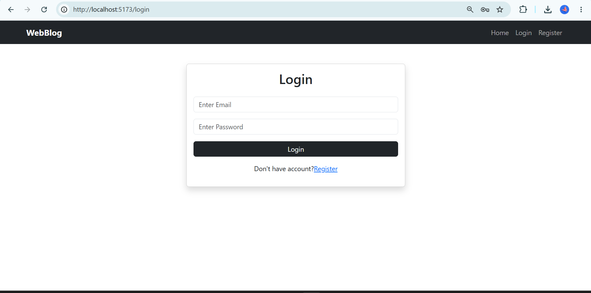
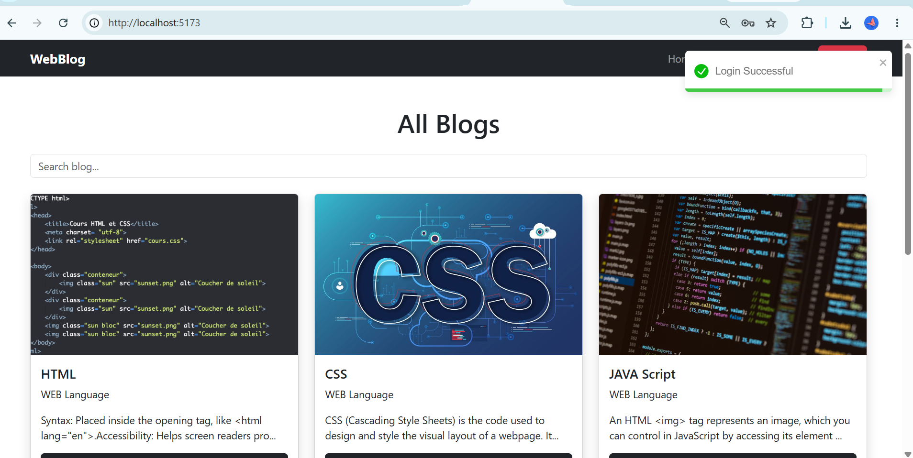
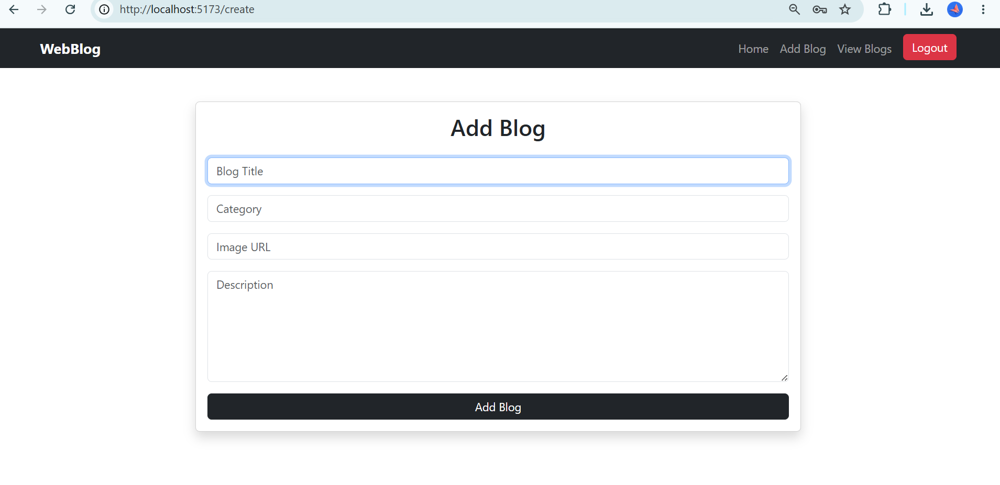
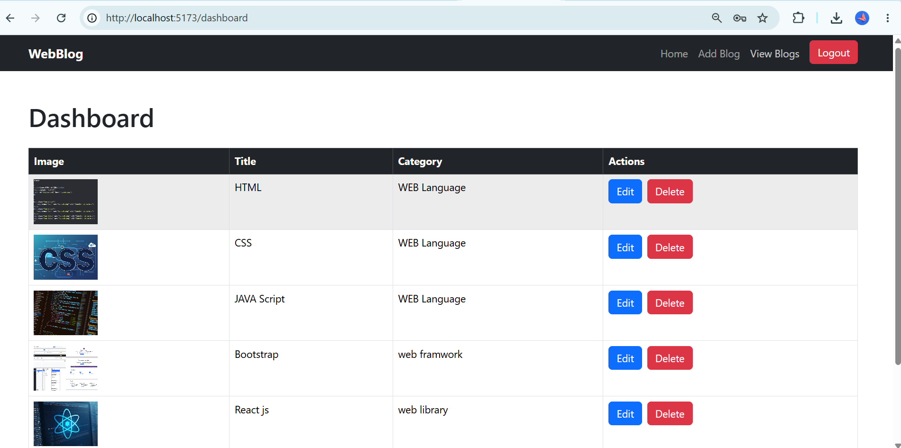
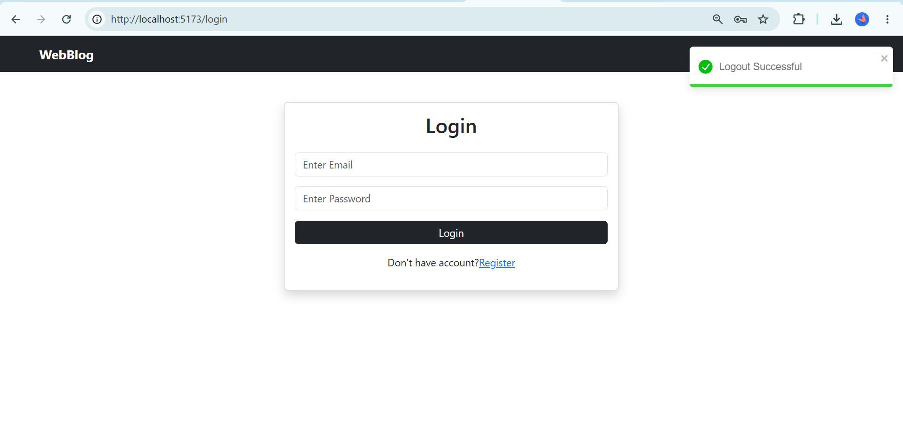

# 📋 React CRUD App

A simple **CRUD (Create, Read, Update, Delete)** application built with **React.js**, **Vite**, and **JSON Server**. This project demonstrates how to perform REST API operations using a mock backend.

---

## 🚀 Features

- 👥 View all users
- ➕ Add a new user
- ✏️ Edit user details
- ❌ Delete users
- 📱 Responsive user interface
- 🔗 REST API integration using JSON Server

---

## 🛠️ Tech Stack

| Technology | Description |
|------------|-------------|
| React.js | Frontend Library |
| Vite | Build Tool |
| JavaScript (ES6+) | Programming Language |
| JSON Server | Mock REST API |
| Axios | HTTP Client |
| React Router DOM | Client-side Routing |
| CSS | Styling |

---

## 📦 Installation

### 1️⃣ Clone the Repository

```bash
git clone https://github.com/your-username/your-repository.git
```

### 2️⃣ Navigate to the Project Folder

```bash
cd your-repository
```

### 3️⃣ Install Dependencies

```bash
npm install
```

---

## ▶️ Running the Application

### Start the React Development Server

```bash
npm run dev
```

The application will be available at:

```
http://localhost:5173
```

---

### Start JSON Server

Open a new terminal and run:

```bash
npx json-server --watch db.json --port 3000
```

Or, if you've added the script in `package.json`:

```bash
npm run server
```

The API will be available at:

```
http://localhost:3000/users
```

---

## 📁 Project Structure

```text
project/
│── public/
│── src/
│   ├── components/
│   ├── pages/
│   ├── App.jsx
│   └── main.jsx
│── db.json
│── package.json
└── README.md
```

---

## 📸 Screenshots

> Place your screenshots inside an `imgs` folder in the project root.

### Home Page



### Add User



### User List



### Edit User



### Delete User



---

## 📌 API Endpoints

| Method | Endpoint | Description |
|--------|----------|-------------|
| GET | `/users` | Fetch all users |
| POST | `/users` | Add a new user |
| PUT | `/users/:id` | Update an existing user |
| DELETE | `/users/:id` | Delete a user |

---

## 📄 License

This project is open-source and available under the **MIT License**.

---

## 👨‍💻 Author

**Your Name**

GitHub: https://github.com/your-username

---

⭐ If you found this project helpful, consider giving it a **Star** on GitHub!